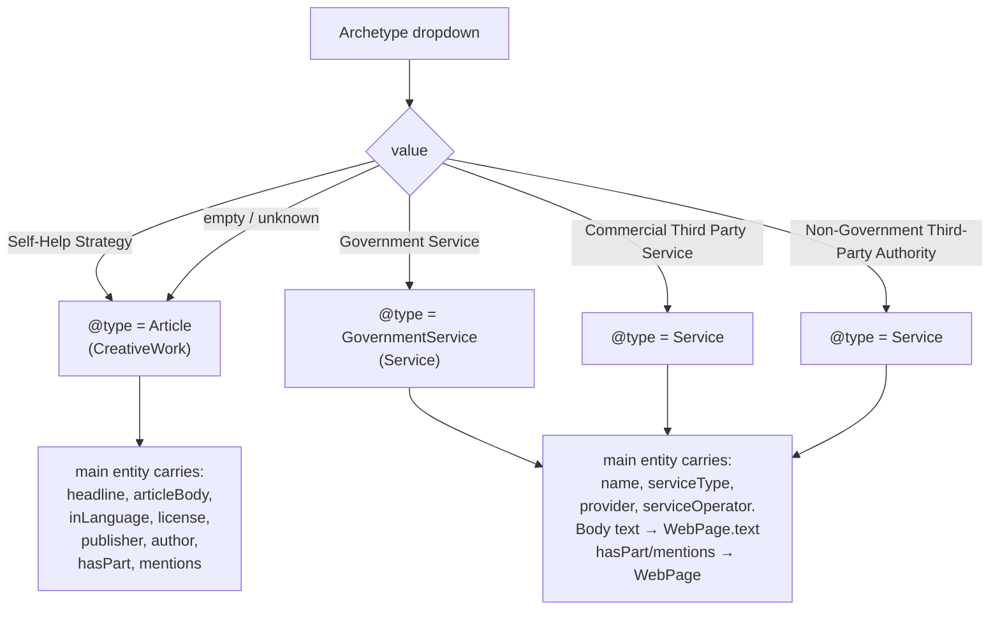
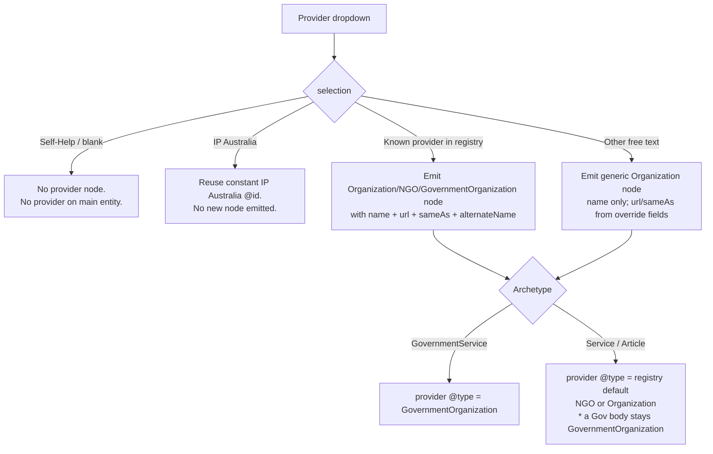
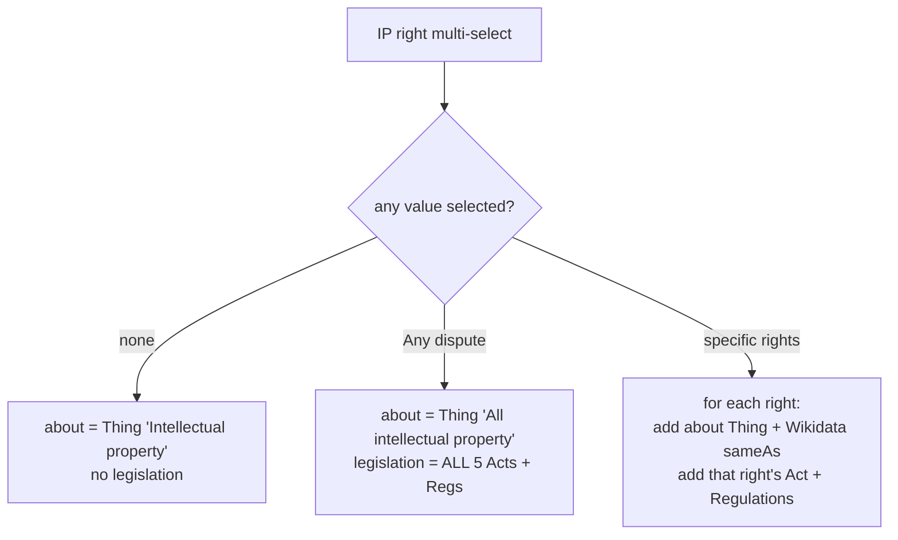
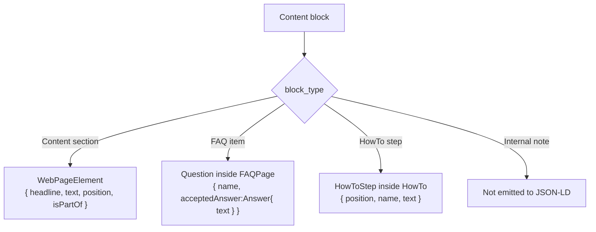
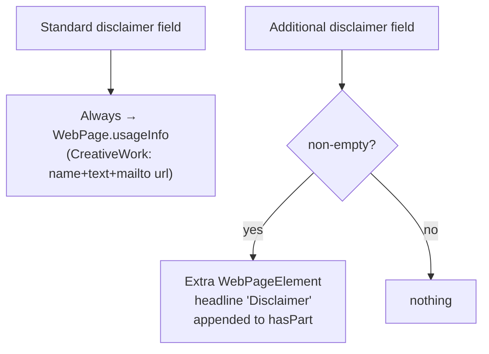
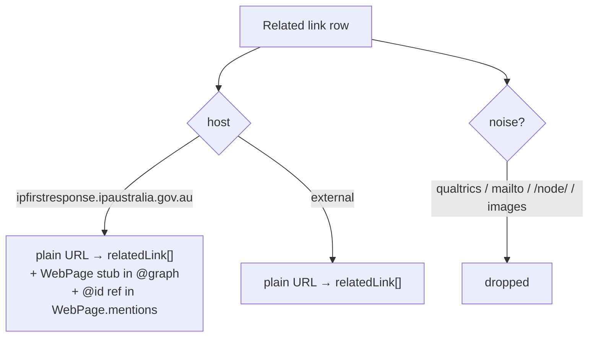

# GovCMS Modular Schema Template — Decision Tree

> **Purpose.** This document specifies, for the web developer, **every field** the
> GovCMS (Drupal) authoring template must expose and **exactly what JSON‑LD each
> field/choice produces**. It is the authoritative companion to
> `govcms-modular-template.html` (a self‑contained, clickable mock‑up of the same
> form that renders a live JSON‑LD preview).
>
> The target output is identical in shape to what
> `scripts/process_md_to_json.py` produces today: a single Schema.org document
> of the form `{ "@context": "https://schema.org", "@graph": [ … ] }` that
> validates as Schema.org and parses as valid JSON.
>
> **Key change from today's pipeline.** Today, content sections, FAQ items and
> HowTo steps are *guessed* from Markdown headings (a heading ending in `?`
> becomes an FAQ; a heading containing "step" becomes a HowTo step). In the
> modular template the author **declares** each block's type from a dropdown, so
> the converter never has to guess. The heuristics in `_classify_heading()` are
> replaced by an explicit `block_type` field.

---

## 0. How to read this document

* **Author input** = something a content owner types or selects in GovCMS.
* **Auto‑derived** = the PHP converter computes it from author input + lookup tables.
* **Constant** = hard‑coded by the converter, identical on every page.
* `#fragment` IDs below are built from the page's canonical URL, e.g.
  `https://…/options/my-page#webpage`.

Decisions are resolved in this order (later decisions can depend on earlier ones):

1. **Archetype** → root content `@type` and where CreativeWork‑only properties live
2. **Provider** → whether a separate provider Organization node is emitted, and its `@type`
3. **Relevant IP right(s)** → `about[]` topics + `Legislation` citation nodes
4. **Modular content blocks** → `WebPageElement` / FAQ `Question` / `HowToStep`
5. **Disclaimer** → `usageInfo` (standard) + optional extra disclaimer section
6. **Entry‑point / journey stage** → `keywords` / `DefinedTerm`
7. **Related links** → `relatedLink[]` + internal `WebPage` reference stubs

---

## 1. Field inventory (what the template must contain)

| # | Field (author‑facing label) | Widget | GovCMS/Drupal field type | Req? | Drives |
|---|------------------------------|--------|--------------------------|------|--------|
| 1 | UDID | text (short) | `string` | ✔ | `WebPage.identifier` + filename |
| 2 | Overtitle | text (short) | `string` | ✖ | navigational label; suppressed from content |
| 3 | Main title | text (short) | `string` | ✔ | `WebPage.name`, main entity `headline`/`name` |
| 4 | Description (SEO summary) | textarea | `string_long` | ✔ | `description` on WebPage + main entity |
| 5 | Canonical URL | URL | `link` / `string` | ✔ | all `@id` bases + `WebPage.url` |
| 6 | Publication date | date | `datetime` | ✖ | `datePublished` |
| 7 | Last updated | date | `datetime` | ✖ | `dateModified`, `copyrightYear` |
| 8 | **Archetype** | **single‑select** | `list_string` | ✔ | root content `@type` (see §2) |
| 9 | **Entry‑point / journey stage** | **multi‑select** | `list_string` (multi) | ✖ | `keywords` / `DefinedTerm` (see §7) |
| 10 | **Relevant IP right(s)** | **multi‑select** | `list_string` (multi) | ✖ | `about[]` + `Legislation[]` (see §4) |
| 11 | **Provider** | **single‑select + Other** | `list_string` + dependent `string` | ✖ | provider org node (see §3) |
| 11a | Provider URL (override) | URL | `link` | ✖ | override registry URL |
| 11b | Provider sameAs (override) | URL (multi) | `link` (multi) | ✖ | override registry `sameAs` |
| 12 | Keywords | tags / multi‑text | `string` (multi) or taxonomy | ✖ | `WebPage.keywords[]` |
| 13 | Intro / lead text | rich text | `text_long` | ✖ | `Article.articleBody` **or** `WebPage.text` (see §2) |
| 14 | **Modular content blocks** (repeatable) | **paragraphs** | `entity_reference_revisions` → Paragraph | ✖ | sections / FAQ / steps (see §5) |
| 15 | Standard disclaimer | rich text (pre‑filled) | `text_long` | ✖ | `WebPage.usageInfo` (see §6) |
| 16 | Additional disclaimer | rich text | `text_long` | ✖ | extra `WebPageElement` (see §6) |
| 17 | **Citations** (repeatable, auto‑seeded) | paragraphs | `entity_reference_revisions` → Paragraph | ✖ | `Legislation[]` (see §4) |
| 18 | Related links (repeatable) | link + text | `link` (multi) | ✖ | `relatedLink[]` + internal refs (see §8) |

**Modular content block** paragraph type (field 14) — each block has:

| Sub‑field | Widget | Type | Notes |
|-----------|--------|------|-------|
| `block_type` | single‑select | `list_string` | `Content section` \| `FAQ item` \| `HowTo step` \| `Internal note (not published)` |
| `heading` | text | `string` | section headline / FAQ question / step name |
| `body` | rich text | `text_long` | section text / FAQ answer / step instructions |

**Citation** paragraph type (field 17) — each citation has `name`, `url`, and a
`legislationType` select (`Act` \| `Regulations` \| `Other`). The list is
**auto‑seeded** from the IP‑right selection (§4) but remains fully editable.

---

## 2. Decision 1 — Archetype → main content `@type`

The single‑select **Archetype** maps directly to the root content entity's
`@type`. This is the most consequential decision because `Article` is a
`CreativeWork` (so it can carry `articleBody`, `text`, `hasPart`, `mentions`,
`inLanguage`, `license`, `publisher`, `author`) while `Service` and
`GovernmentService` are **not** CreativeWorks (those properties move to the
`WebPage`).



| Archetype (dropdown value) | Main entity `@type` | `@id` fragment | Title property | Body text lands on | `hasPart` / `mentions` live on |
|----------------------------|---------------------|----------------|----------------|--------------------|-------------------------------|
| `Self-Help Strategy` | `Article` | `#article` | `headline` | `Article.articleBody` | the `Article` |
| `Government Service` | `GovernmentService` | `#governmentservice` | `name` | `WebPage.text` | the `WebPage` |
| `Commercial Third Party Service` | `Service` | `#service` | `name` | `WebPage.text` | the `WebPage` |
| `Non-Government Third-Party Authority` | `Service` | `#service` | `name` | `WebPage.text` | the `WebPage` |

### 2.1 Auto‑collapse rule (replicates existing "Fix 3")

If the archetype is a Service/GovernmentService **but** the page has **no FAQ
items** and its only content blocks are intro‑style sections (e.g. "What is
it?" / "Overview"), today's code downgrades the `@type` to `Article` to avoid
duplicating the same body text in two places.

> **Recommendation for the modular build:** because block types are now explicit,
> this implicit collapse is no longer necessary and is arguably surprising. Keep
> the author's archetype choice authoritative. *Flagged for your decision — see
> README "Open questions".*

---

## 3. Decision 2 — Provider → provider Organization node



**Provider `@type` resolution** (`resolve_provider_type_for_archetype`):

| Archetype | Provider source | Resulting provider `@type` |
|-----------|-----------------|----------------------------|
| `GovernmentService` | any | `GovernmentOrganization` |
| `Service` | registry says NGO | `NGO` |
| `Service` | registry says Organization | `Organization` |
| `Service` | registry says Government body (e.g. Court) | `GovernmentOrganization` |
| `Article` | any | registry default (`Organization` unless overridden) |

**Where the provider is referenced on the main entity:**

| Archetype | Properties added |
|-----------|------------------|
| `GovernmentService` | `serviceOperator: {@id}` **and** `provider: {@id}` |
| `Service` | `provider: {@id}` |
| `Article` | *(none — Articles have no provider)* |

**Curated provider dropdown** (auto‑fills url/sameAs/@type from the registry;
authors may override via fields 11a/11b):

| Dropdown label | `@type` | url | sameAs |
|----------------|---------|-----|--------|
| Self‑Help (no external provider) | — | — | — |
| IP Australia | GovernmentOrganization | ipaustralia.gov.au | Q5973154 |
| Australian Border Force | GovernmentOrganization | abf.gov.au | Q17000879 |
| Australian Small Business & Family Enterprise Ombudsman | GovernmentOrganization | asbfeo.gov.au | — |
| Federal Court of Australia | GovernmentOrganization | fedcourt.gov.au | Q1400030 |
| Trans‑Tasman IP Attorneys Board | GovernmentOrganization | ttipattorney.gov.au | — |
| .au Domain Administration (auDA) | NGO | auda.org.au | Q151602 |
| World Intellectual Property Organization (WIPO) | NGO | wipo.int | Q177773 |
| WIPO Arbitration and Mediation Center | NGO | wipo.int/amc | Q177773 |
| Australian Copyright Council | NGO | copyright.org.au | Q4824042 |
| Legal service provider | Organization | — | — |
| eCommerce provider | Organization | — | — |
| Mediator | Organization | — | Q4859473 |
| Arbitrator | Organization | — | Q105425483 |
| Qualified facilitator | Organization | — | Q1150166 |
| Qualified Person | Organization | — | — |
| IP Insurers | Organization | — | — |
| IP professionals | Organization | — | — |
| Online Marketplaces | Organization | — | Q3390477 |
| **Other…** (free text) | Organization | from 11a | from 11b |

> **Compound providers** (e.g. *"ACCC, ASCS, AFP, IP Australia"*). Today the code
> resolves the **first recognised government body**. In the modular template,
> prefer letting the author pick the single primary provider from the dropdown
> and list the rest as related links. *Flagged in README "Open questions".*

---

## 4. Decision 3 — Relevant IP right(s) → `about[]` + `Legislation[]`

The **multi‑select** "Relevant IP right(s)" drives two things at once: the
Schema.org `about` topics (with Wikidata `sameAs`) and the auto‑seeded
`Legislation` citations.



**Per‑right mapping** (deduplicated; `Act` + `Regulations` pairs added to citations):

| Dropdown value | `about` Thing name | Wikidata sameAs | Legislation auto‑added |
|----------------|--------------------|-----------------|------------------------|
| Trade mark | Trade mark | Q165196 | Trade Marks Act 1995 + Regulations 1995 |
| Unregistered trade mark | Unregistered trade mark | Q165196 | Trade Marks Act 1995 + Regulations 1995 |
| Patent | Patent | Q253623 | Patents Act 1990 + Regulations 1991 |
| Design | Design | Q1240325 | Designs Act 2003 + Regulations 2004 |
| Plant Breeder's Rights (PBR) | Plant breeder's rights | Q695112 | PBR Act 1994 + Regulations 1994 |
| Copyright | Copyright | Q12978 | Copyright Act 1968 + Regulations 2017 |
| Any IP right | *(emits each selected/■ all topics)* | — | — |
| Any dispute | All intellectual property (IP) | Q108855835 | **all** of the above |

Each `Legislation` node is emitted into the `@graph` as:

```json
{ "@type": "Legislation", "@id": "<url>", "name": "<title>", "url": "<url>", "legislationType": "Act" }
```

…and referenced from `mentions` (on the `Article`, or on the `WebPage` for
Service types — see §2). The **Citations** paragraph list (field 17) is
pre‑populated from this mapping so authors can see, add, or remove citations.

---

## 5. Decision 4 — Modular content blocks → sections / FAQ / steps

This is the heart of the modular redesign. Each repeatable block carries an
explicit `block_type`. **No heading heuristics are used.**



| `block_type` | JSON‑LD produced | `@id` pattern | Grouped into |
|--------------|------------------|---------------|--------------|
| `Content section` | `WebPageElement` with `headline`, `text`, `position`, `isPartOf` | `…#section-{n}-{slug}` | listed in `hasPart` |
| `FAQ item` | `Question` + nested `Answer` | `…#faq-q{n}` / `…#faq-q{n}-a` | one `FAQPage` (`…#faq`) |
| `HowTo step` | `HowToStep` with `position`, `name`, `text` | *(positional, inside HowTo)* | one `HowTo` (`…#howto`) |
| `Internal note (not published)` | nothing | — | — |

**`isPartOf` target for sections** depends on archetype (§2):

* Archetype = `Article` → `isPartOf` = `…#article`
* Archetype = Service/GovernmentService → `isPartOf` = `…#webpage`

**Wrapper nodes are emitted only if at least one child exists:**

* ≥1 `FAQ item` ⇒ emit one `FAQPage` node holding all `Question`s.
* ≥1 `HowTo step` ⇒ emit one `HowTo` node holding all `HowToStep`s.
* `position` numbers are assigned in author‑defined block order.

---

## 6. Decision 5 — Disclaimers



| Field | Default | Output |
|-------|---------|--------|
| Standard disclaimer | pre‑filled with the canonical IP First Response disclaimer text (editable per answer to "Boilerplate") | `WebPage.usageInfo` → `CreativeWork { name: "Disclaimer and Feedback Policy", text, url: mailto }` |
| Additional disclaimer | empty | extra `WebPageElement { headline: "Disclaimer", text, position: last+1, isPartOf }` added to `hasPart` |

---

## 7. Decision 6 — Entry‑point / journey stage → `keywords` / `DefinedTerm`

The **multi‑select** journey‑stage field is new (not emitted by today's
pipeline). Controlled vocabulary (normalised — note the source CSV contains
typos like "Enforcment" that the dropdown eliminates):

`IP Basics` · `Infringement 101` · `Proactive` · `Enforcement` · `Accused` · `Case Study`

Recommended mapping — emit each selected stage as a `DefinedTerm` in
`WebPage.keywords` (valid Schema.org; `keywords` accepts `Text` **or**
`DefinedTerm`):

```json
"keywords": [
  { "@type": "DefinedTerm", "name": "Enforcement",
    "inDefinedTermSet": "https://ipfirstresponse.ipaustralia.gov.au/#journey-stages" },
  "…author keywords as plain strings…"
]
```

> Simpler alternative: append the stage labels as plain‑text `keywords`. The
> `DefinedTerm` form is preferred because it keeps the controlled vocabulary
> machine‑distinguishable from free keywords. *Flagged in README "Open questions".*

---

## 8. Decision 7 — Related links → `relatedLink[]` + internal stubs



* All links (internal + external) appear as **plain URL strings** in
  `WebPage.relatedLink[]`.
* Internal IPFR links additionally emit a `WebPage` stub node (`@type: WebPage`,
  with `name`/`description`/`identifier` from the linked page's CMS record when
  resolvable) and an `@id` reference under `WebPage.mentions`.
* Noise links (Qualtrics feedback, `mailto:`, `/node/…`, images, tracking
  params) are dropped.

---

## 9. The full `@graph` assembly order

Every page emits the nodes below, in this order. **Bold** nodes are always
present; the rest are conditional.

| Order | Node | Condition |
|-------|------|-----------|
| 1 | **IP Australia `GovernmentOrganization`** | constant |
| 2 | Provider `Organization`/`NGO`/`GovernmentOrganization` | provider ≠ IP Australia / Self‑Help (§3) |
| 3 | **`WebSite`** | constant |
| 4 | **`WebPage`** | built from page‑level fields |
| 5 | **Main entity (`Article`/`GovernmentService`/`Service`)** | from archetype (§2) |
| 6 | `HowTo` | ≥1 HowTo‑step block (§5) |
| 7 | `WebPageElement[]` (content sections + extra disclaimer) | ≥1 section block / additional disclaimer (§5–6) |
| 8 | `FAQPage` | ≥1 FAQ block (§5) |
| 9 | `Legislation[]` | from IP right(s) / citations (§4) |
| 10 | Internal `WebPage` stubs | internal related links (§8) |

---

## 10. Worked outcomes (cross‑reference the HTML preview)

| Scenario | Archetype | Provider | Main `@type` | Notable nodes |
|----------|-----------|----------|--------------|---------------|
| Self‑help explainer with 2 sections + 1 FAQ | Self‑Help Strategy | Self‑Help | `Article` | `Article` (articleBody, hasPart), 2× `WebPageElement`, `FAQPage`, `Legislation[]` |
| Government application service with steps | Government Service | IP Australia | `GovernmentService` | `GovernmentService` (serviceOperator+provider→IP Aus), `HowTo`+`HowToStep[]`, body on `WebPage.text` |
| Commercial third‑party (ADR) overview | Commercial Third Party Service | Qualified facilitator | `Service` | new `Organization` provider node, `Service.provider`, body on `WebPage.text` |
| Non‑gov authority referral | Non‑Government Third‑Party Authority | WIPO | `Service` | `NGO` provider node, `Service.provider` |

Open `govcms-modular-template.html` in a browser, fill the form, and watch the
**Live JSON‑LD preview** update to match each row above.
