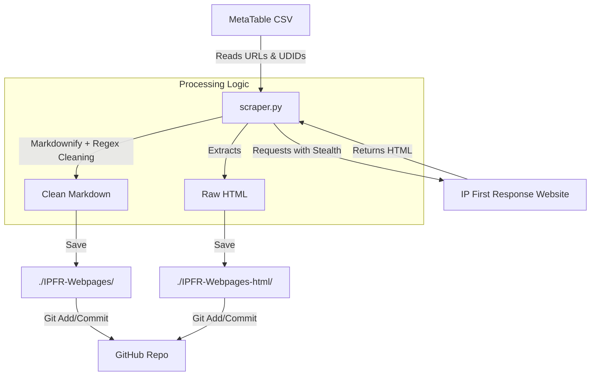

# IP First Response (IPFR) Scraper Architecture

## Overview

The IPFR Scraper is an automated content ingestion pipeline designed to mirror content from the [IP First Response](https://ipfirstresponse.ipaustralia.gov.au/) website.

The system utilizes a **"Headless Browser"** approach (Selenium) to render dynamic content, converts the HTML into clean, structured Markdown, and commits the results back to the repository via GitHub Actions. This allows the dataset to remain current without manual intervention.

## System Components

The architecture consists of three core components:

1. **The Controller (CSV):** Defines *what* to scrape.
2. **The Engine (Python/Selenium):** Defines *how* to scrape and process content.
3. **The Automator (GitHub Actions):** Defines *when* to run and how to store results.

---

## 1. The Controller: Metadata CSV

**File:** `metatable-Content.csv` (derived from `260203_IPFRMetaTable.csv`)

The scraper is **deterministic**, meaning it does not crawl links randomly. It iterates strictly through a provided CSV manifest. This ensures that only authoritative, pre-approved pages are ingested.

* **Key Field - `UDID`:** A Unique Document ID (e.g., `D1017`, `B1000`). This is used to generate stable filenames (e.g., `D1017 - Challenge a new or amended patent.md`). If the page title changes in the future, the file remains traceable via its UDID.
* **Key Field - `Canonical-url`:** The direct target for the scraper.

---

## 2. The Engine: `scraper.py`

The Python script performs a sophisticated "Stealth Scrape" to avoid detection and ensure high-fidelity content extraction.

### A. Initialization & Stealth

Standard bot traffic is often blocked by government firewalls (WAFs). To bypass this, the script uses `selenium-stealth`:

* **Headless Chrome:** Runs a real Chrome browser instance without a UI.
* **Stealth Masking:** Overrides the `navigator.webdriver` property, spoofs the User-Agent, and mocks hardware inputs (WebGL vendor, Renderer) to appear as a legitimate Windows 10 user.

### B. Content Isolation Strategy

The script does not simply dump the entire `<body>` tag, which would include navigation bars, footers, and sidebars. It attempts to isolate the core content using a priority logic:

1. **Priority 1:** `<main>` tag (Semantic HTML standard).
2. **Priority 2:** `.region-content` class (Drupal specific wrapper).
3. **Fallback:** `<body>` (If specific wrappers fail).

### C. The "Markdownify" Pipeline

Once HTML is retrieved, it undergoes a transformation pipeline to become LLM-ready Markdown:

1. **Raw Conversion:** The `markdownify` library converts HTML tags to Markdown (e.g., `<h1>` becomes `#`, `<b>` becomes `**`).
2. **Noise Removal:** Regex patterns strip out web-only artifacts that degrade data quality for RAG (Retrieval-Augmented Generation) systems:
* "Was this information useful?" widgets.
* "Opens in a new tab" screen reader text.
* Feedback buttons.

3. **Normalization:**
* Smart quotes (curly quotes) are normalized to ASCII straight quotes to prevent encoding issues.
* Headers are standardized (e.g., promoting `##` to `###` to maintain hierarchy under the main title).

4. **Metadata Injection:** The script injects the source URL and Title at the very top of the Markdown file. This provides context to any LLM reading the file later.

### D. Dual Output & Telemetry

The script produces three distinct outputs per run:

1. **Markdown (`IPFR-Webpages/`):** The clean, processed text for usage.
2. **Raw HTML (`IPFR-Webpages-html/`):** The raw source code, saved for debugging or re-processing if the parsing logic needs to change later.
3. **Session Report (`scrape_reports/`):** A CSV generated at the end of every run detailing which URLs succeeded, which failed, and file sizes.

---

## 3. The Automator: `scrape.yml`

The GitHub Actions workflow ensures the dataset is "self-healing" and "ever-green."

### Trigger Logic

* **Cron Schedule (`0 */6 * * *`):** Runs automatically every 6 hours.
* **Workflow Dispatch:** Can be manually triggered from the GitHub Actions tab for immediate updates.

### The CI/CD Pipeline

1. **Environment Setup:** Installs Python 3.9 and the latest Chrome browser.
2. **Execution:** Runs `scraper.py`.
3. **Smart Commits:**
* The workflow configures a git user (`IPFR Scraper Bot`).
* It checks `git diff` to see if any files actually changed.
* **Logic:** If the website content hasn't changed, the markdown output remains identical, and no commit is made (keeping the git history clean).
* If content *has* changed, it commits and pushes the updates immediately.

---

## Data Flow Diagram

## Error Handling

* **Network Timeouts:** The driver waits up to 30 seconds for the `<body>` to present itself.
* **DOM Changes:** If the specific HTML class structure of the target site changes, the script logs a warning but attempts to fall back to broader tags to ensure *some* content is captured.
* **Reporting:** All errors are logged to the `scrape_report_TIMESTAMP.csv` file, allowing developers to identify broken links or changed page structures quickly.
